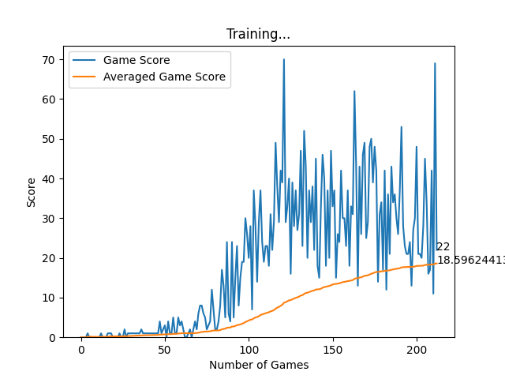
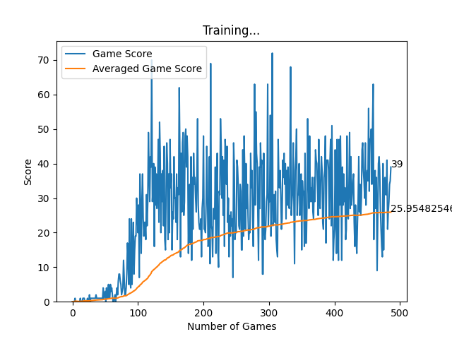
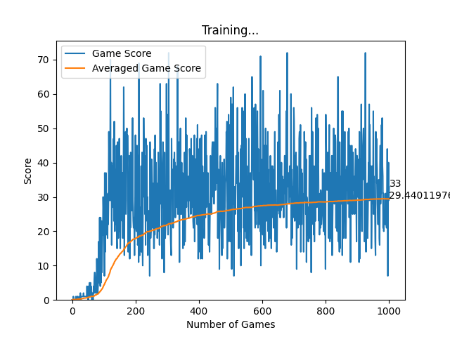

<div style="text-align: center"><h3>Reinforcement Learning With PyTorch and Pygame</h3></div>
<div style="text-align: center"><h5>Teaching AI to play clasic Snake Game </h5></div> 

<div style="text-align: justify"> 
This project demonstrates the use of <b>Reinforcement Learning</b> with <b>PyTorch</b> and <b>Pygame</b> to teach an AI agent to play the classic Snake game. The project is structured into three parts, each focusing on different components necessary to build and train the AI. The project’s learning algorithm is based on a <b>Deep Q-Network</b> model, which applies the <b>Bellman Equation</b> to optimize the agent's learning process.
</div>
<hr>

<h6>Project Overview</h6>
<div style="text-align: justify">
The goal of this project is to showcase how reinforcement learning techniques, specifically a Deep Q-Network (DQN), can develop an agent capable of playing the Snake game autonomously. By leveraging PyTorch for deep learning and Pygame for the game environment, the project takes a step-by-step approach to progressively build the game, the neural network model, and the learning agent. The DQN is a simplified version of Bellman Equation, which aids in the computation of optimal targets for the AI model to train.
</div>
<hr>

<h6>Part 1: Building the Snake Game with Pygame</h6>
<div style="text-align: justify">
In this part, the classic Snake game is recreated using Pygame. The game layout, game logic, and mechanics are defined here. Below is a snippet showing how the window layout of the game is created:
</div>

                             
                            Windows Resolution
                |-----------------------------------------|
                |        Score Board  (Top Offset)        |
                |   -----------------------------------   |
                |   |                                 |   |
                |   |                                 |   |
                |   |                                 |   |
                |   |                                 | R |
                | L |                                 | I |
                | E |           Frame Area            | G |
                | F |                                 | H |
                | T |                                 | T |
                |   |                                 |   |
                |   |                                 |   |
                |   |                                 |   |
                |   -----------------------------------   |
                |             Bottom Offset               |
                |-----------------------------------------|

In the above layout the score board only changes when the score changes and the frame area changes every step the snake takes.


The entire game is writen in a class **SnakeGame**, cointaing the following:
 1. **Initializer:** It initials the game window by plcing the walls around the frame and placing snake and food randomly in the frame.
 2. **Input handler:** It handles all the user input and and desides what the snake has to do next.
 3. **Snake tracker:** It tracks the snakes movement by checking if the snake hits the wall or eats the food or itself
 4. **Runner:** It runs the input andler and the snake tracker cohesively.
<hr>

<h6>Part 2: Building the Neural Network Model and Deep Q Tainer </h6>
<div style="text-align: justify">
This part focuses on implementing a simple linear neural network model in PyTorch. The network takes game state as input and outputs the next action for the snake. The model is a very simple neural network with 1 hiden Linear layers. The model takes in 11 states (danger left, danger ahead, danger right, direction up, direction down, direction left, direction right, food up, food down, food left, food right) of the snake and outpurs a vector of 3 possible actions (Turn Left, Go Stright, Turn Righ). 
</div>
```python

    class Lin_Qnet (nn.Module):
        def __init__ (self, layer_sizes : list | tuple | np.ndarray):
            super(Lin_Qnet, self).__init__()

            layers_dict = OrderedDict()
            for n, (i, o) in enumerate(pairwise(layer_sizes)):
                layers_dict[f'Linear{n}'] = nn.Linear(i, o)

            self.model = nn.Sequential(layers_dict)

        def forward(self, x):
            return self.model(x)

        def save(self, filename : str | None = None): ...

        def load(self, filename : str | None = None): ...
```


The trainer is based off of simplified Bellman Equations:
$
    Q(s, a) = r + \gamma \, \max_{a'} Q(s', a')
$

**Explanation of Terms:**
- **\( Q(s, a) \)**: The action-value function, which gives the expected reward for taking action \( a \) in state \( s \).
- **\( r \)**: The immediate reward obtained after taking action \( a \) in state \( s \).
- **\( \gamma \)**: The discount factor (typically \( 0 \leq \gamma \leq 1 \)), representing the importance of future rewards. A higher \( \gamma \) means future rewards are given more weight.
- **\( \max_{a'} Q(s', a') \)**: The maximum estimated future reward for the next state \( s' \) across all possible actions \( a' \) in that state. This term encourages the agent to choose actions that maximize future rewards.


```python

        class DeepQTrainer:
            def __init__(self, 
                        model:nn.Module, 
                        gamma:float, 
                        optimizer:optim.Optimizer | None = None, 
                        criterion:nn.Module | None = None):

                self.gamma = gamma
                self.model = model
                self.optimizer = optimizer if optimizer else optim.Adam(model.parameters(), lr=0.001)
                self.criterion = criterion if criterion else nn.MSELoss()

            def train(self, 
                    state:list[int]|list[list[int]], 
                    action:list[int]|list[list[int]], 
                    nxt_state:list[int]|list[list[int]], 
                    reward:int|list[int], 
                    game_over:int|list[int]):

                # get the prediction of current state
                predict = self.model(state)

                # clone this to target
                target = predict.clone()

                # update the target to new Q values using the formula:
                # Q_new = reward + gamma * max (prediction of nxt_state)
                # update this Q_new to target node where the action is maximum

                Q_new = reward[idx]

                # since there is no next state if game over
                # ignore game over state
                if not game_over[idx]:
                    Q_new += (self.gamma * torch.max(self.model(nxt_state[idx])))

                target[idx][torch.argmax(action).item()] = Q_new

                self.optimizer.zero_grad()
                loss = self.criterion(target, predict)
                loss.backward()
                self.optimizer.step()

```
<hr>


<h6>Part 3: Building an Agent</h6>
<div style="text-align: justify">
The agent is developed by extending the SnakeGame class to allow the agent to interact with and obtain real-time information from the game. The new extended class SnakeGameAI has the folowing functionalities:
</div>

1. Get the state of the game 
2. Get the action based on the state (Makes random choices half of the time) (First 100 games)
3. Get Reward for the system based on the action
4. Save the previous state of the game 
5. Train the model for the current state of the game
6. Train the model for a batch of actions at the end for a LSTM like model 

Reward system:

            # * move towards food   -> +5
            # * move away from food -> -5
            # * Eat food            -> +10
            # * Game over           -> -10

<hr>

The final training graph is showing the folowing snippet:


